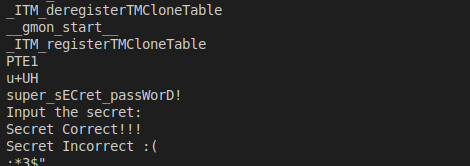

# CODED SECRETS

<a href='' target="_blank"></a>

A common mistake is placing secrets directly into the source code as plain text. This should be avoided because it exposes sensitive information that can lead to unauthorized access or data breaches. Instead, consider alternative methods—such as environment variables, secret management services, or vaults—to store and manage your secrets.

## Compromised Code
In this code, the program asks the user for a password and checks whether it matches a secret. The problem is that the password is hard-coded directly into the source code.

```shell
const char secret[STR_SIZE] = "super_sECret_passWorD!";
```

While the secret is not displayed to the user, it remains embedded in the binary file.

### Compile the Source Code
If you want to proceed, you can compile the program using the Makefile. Note that GCC and make must be installed on your machine to compile the source code.

This command builds the program into a binary file (coded_secrets.sh):
```shell
make
```
To run the program, use:
```shell
./coded_secrets.sh
```

## Finding the Secret
The program prompts for a secret, compares it to the hard-coded password in the source code, and displays a message indicating whether the password is correct.
```shell
Input the secret: 
Secret Incorrect :(
```
Now, the question is, how do we find the secret? In Linux, there is a tool called "strings"—a similar tool can be downloaded for Windows—that extracts all the text from the binary file.

You can do this by running the following command:
```shell
strings coded_secrets.sh
```
The command displays all the text within the binary file, including the secret: super_sECret_passWorD!



## Mitigation
The best approach to mitigate this issue is to avoid using hard-coded secrets altogether. However, this is often easier said than done, because we still need a reliable method to store secrets.

Authorization passwords should never be stored in plain text; instead, they must be stored as hashes—secure representations of the original passwords. Use a strong, modern hashing algorithm (e.g., SHA-256 or better, or a dedicated password-hashing function like bcrypt or Argon2) to prevent the original password from being easily recovered if the hash is leaked. And, of course, the hash itself should not be hard-coded into your application.

For cloud services, this process is fairly straightforward. Two-factor authentication (2FA) is now commonplace, often combined with frameworks like OAuth 2.0 or third-party services such as Auth0. This makes it difficult for attackers to gain access without knowing the actual password.

For other secrets, like encryption keys, most platforms provide secure Key Management Services (KMS) that store secrets and certificates securely.

For local applications with user authentication, whenever possible, use a remote authentication service—either a custom service or a third-party solution—and avoid storing passwords on the local machine. If necessary, consider using tokens that can be revoked and that expire after a certain period. In situations where remote services are not an option, environment variables can be a safer alternative—though not for user authentication secrets. This ensures that the secret is not hard-coded and is harder for an attacker to extract from a compiled binary. However, it still leaves the question of how to securely configure the environment variable without storing the secret elsewhere in plain text.

When possible, use certificates—with asymmetric algorithms—for encryption, authentication, and signing. Note that using certificates for client authentication requires securely storing the client’s private key on the local machine, which is a challenge in itself. Although different operating systems provide certificate stores, if the machine is compromised, the private key could still be leaked. For additional security, certificate-based authentication can be combined with 2FA or similar methods.

For embedded devices, avoid using a single, shared key across all devices. Whenever possible, use certificates and design the devices with a root of trust or a secure element so that secrets can be stored more securely—especially if encryption, data transmission, or authentication depends on them.
