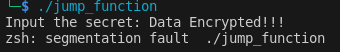
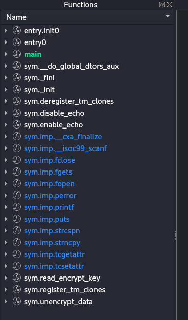
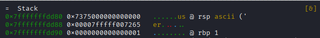

# FUNCTION JUMP
<a href='' target="_blank"></a>

(Work In Progress)
Another common mistake is leaving code that compromises information or secrets in the codebase, even if it’s not “accessible” because the call has been commented out. For example, in the following code, the function r*ead_encrypt_key* is commented out, yet the function itself remains in the codebase (and, as we’ll see later, still appears in the binary).

```c
int main() {
    char input[10];
    disable_echo();

    // 1. Unsafe read the users' input
    printf("Input the secret: ");
    scanf("%s", input);
    
    // 2. Remove line break
    input[strcspn(input, "\n")] = '\0';
    
    enable_echo();

    // only for testing, please comment in production
    /*
    if (read_encrypt_key(input, sizeof(input)) != 0){
        printf("Error reading key \n");
    }*/

    // 3. Un-encrypt
    unencrypt_data(input);

    return 0;
}
```

## Compile the Source Code
If you want to follow the next steps, you can compile the program using the provided Makefile. Note that gcc and make must be installed on your machine to compile the source code.

The following command builds the program into a binary file named jump_function.sh.
```shell
make
```
To run the program, use:
```shell
./jump_function.sh
```


## Analyzing the Binary
In the same way as in the previous section, we can list all the strings in the binary. In this case, no key has been encoded.

When we run the program, it prompts us for a key to decrypt a message. If we enter a short text, it just prints the message Data Encrypted; but if we enter a long message, we receive an error. Since the error is a *segmentation fault* error, we can deduce that the program is not limiting the size of the data being input by the user.



The next step is to inspect the list of functions available in the binary. We’ll use [Cutter](https://cutter.re/) for this. After opening the jump_function.sh binary in Cutter, you can see a list of functions on the left side. Among them is one that can be of interest: *sym.read_encrypt_key*. Notice that, even though this function was commented out in the source code, it still appears in the compiled binary.



Given the earlier error and the fact that the function is still present in the binary, we might be able to call it. Since we have the source code, we know this function prints the secret key. If we didn’t have the source, we could check the Disassembly tab in Cutter and see that it calls fgets to read from a file, followed by puts to print the data.


Note, that if [Ghidra](https://ghidra-sre.org) is installed we can actually see the decompiled code, but it may be a bit hard to read.

## Debugging
We can debug the binary using [Radere2](https://rada.re/n/), and see what happens in memory when we reproduce the *segmentation fault* error.

We beging the debugging process with the following command - make sure Radare2 is intalled -:
```shell
r2 -d ./jump_function.sh
```

Inside Radare2, we can use the *db* command to add a breakpoint, and *dc* to continue execution. For example, to place a breakpoint at the main function, you can run:

```shell
db sym.main
dc
```


If we want to see the disassembly while debugging, we can use the vc command to enter Visual Mode.

We’ll place a second breakpoint at the echo call, which occurs right after the program reads the user input. By using Visual Mode, we can find the address of the instruction - note that it may differ from the address shown in the screenshot -. After setting the breakpoint, we can use *dc* to continue the program execution.


The program will ask for user input. Here, we will provide a long string consisting solely of the character 'A'. Returning to Visual Mode, we can see that the memory is flooded with 'A's - even the rbp register is overwritten -. This can potentially allow us to call the *sym.read_encrypt_key* function.

Furthermore, simply giving the program with a long enough message can crash it. For example, if this program was running as a remote service on a server, sending excessively long input could break the service and render it unavailable.


Without the overflow, the memory appears as follows. We can see that the *rbp* register points to the previous stack frame.



(WIP) to be continued...

## System and Compilers Safeguards
(WIP) Add more info about canary, ASLR and DEP
This kind of vulnerabilities use buffer overflows to modify the memory stack.
Over the years, both compilers and OSs have implemented safeguards - such as Stack Canaries (also known as Stack Guard), Address Space Layout Randomization (ASLR), No-Execution bit and Data Execution Prevention (DEP) - that are meant to prevent this type of attack. 

While these protections make it harder for a malicious third party to explote buffers overflow, they still can be bypassed or circumvented.
It is also important to note, that different systems or compilers can have some safeguards active but not other.
For example, using the same code and Make file to compile the program jump_function in two different systems - an Ubuntu host and a Kali Virtual Machine -, 
generates two executables with different safeguards.


Host, with non-executable bit (nx) and canary safeguards activated


Kali VM, with non-executable bit (nx) safeguard activated, but canary deactivated


### ASLR
Random Memory
```shell
sysctl -w kernel.randomize_va_space=2
gcc -fno-stack-protector ... 
```

### DEP and NX bit
Protects memory by marking regions as non-executable

### Canary
Buffer overflow protection, by adding control data on the stack
Segmentation error control.
```make
-fno-stack-protector
```

## Mitigation
The most obvious approach is to not leave testing code into the source code that can potentially expose confidential information or secrets, but even then we risk other problems, like a service becoming unavailable.

In order to mitigate this kind of problems we can start by making sure the size of the data readed is limited to the size of the buffer. This can be done, using functions that force to specify the maximum number of bytes to read. For instance, instead of using functions like gets() (which is unsafe and deprecated) or a naive scanf("%s", buf), it is safer to use alternatives such as fgets(buf, sizeof(buf), stdin). It is still importan, to specify the correct size of the buffer in the second parameter, otherwise we can still run into a buffer overflow.

Additionally, you should always verify the return values of these functions to handle cases where reading fails or doesn’t consume as many bytes as expected.

Beyond the use of safe functions, validating the content of user-supplied data is crucial, if a certain field is supposed to hold only numeric values or specific symbols, always validate the data hformat. By limiting the size and validating the input data, ythe probability of accidental buffer overflows is reduced.

Since this is easier said than done, a good practice would be using static code analyzers that are capable to analyze source code in search of vulnerbilities and common issues.

Finally, we can compile our code with security-hardening flags. For example, most modern compilers offer stack-protector or address sanitizer features that can help detect out-of-bounds writes or reads during development and testing.


