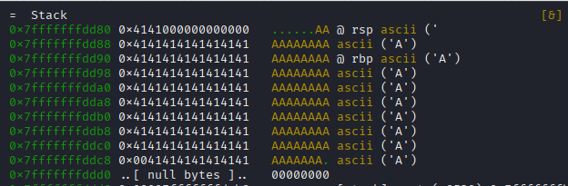

# FUNCTION JUMP
<a href='' target="_blank"></a>

(Work In Progress)
Another common mistake is leaving code that compromises information or secrets in the codebase, even if it’s not “accessible” because the call has been commented out. For example, in the following code, the function r*ead_encrypt_key* is commented out, yet the function itself remains in the codebase (and, as we’ll see later, still appears in the binary).

```c
int main() {
    char input[10];
    disable_echo();

    // 1. Unsafe read the users' input
    printf("Input the secret: ");
    scanf("%s", input);
    
    // 2. Remove line break
    input[strcspn(input, "\n")] = '\0';
    
    enable_echo();

    // only for testing, please comment in production
    /*
    if (read_encrypt_key(input, sizeof(input)) != 0){
        printf("Error reading key \n");
    }*/

    // 3. Un-encrypt
    unencrypt_data(input);

    return 0;
}
```

## Analyzing the Binary
In the same way as in the previous section, we can list all the strings in the binary. In this case, no key has been encoded.

When we run the program, it prompts us for a key to decrypt a message. If we enter a short text, it just prints the message Data Encrypted; but if we enter a long message, we receive an error. Since the error is a *segmentation fault* error, we can deduce that the program is not limiting the size of the data being input by the user.


The next step is to inspect the list of functions available in the binary. We’ll use [Cutter](https://cutter.re/) for this. After opening the jump_function.sh binary in Cutter, you can see a list of functions on the left side. Among them is one that can be of interest: *sym.read_encrypt_key*. Notice that, even though this function was commented out in the source code, it still appears in the compiled binary.


Given the earlier error and the fact that the function is still present in the binary, we might be able to call it. Since we have the source code, we know this function prints the secret key. If we didn’t have the source, we could check the Disassembly tab in Cutter and see that it calls fgets to read from a file, followed by puts to print the data.


Note, that if [Ghidra](https://ghidra-sre.org) is installed we can actually see the decompiled code, but it may be a bit hard to read.

## Debugging
We can debug the binary using [Radere2](https://rada.re/n/), and see what happens in memory when we reproduce the *segmentation fault* error.

We beging the debugging process with the following command - make sure Radare2 is intalled -:
```shell
r2 -d ./jump_function.sh
```

Inside Radare2, we can use the *db* command to add a breakpoint, and *dc* to continue execution. For example, to place a breakpoint at the main function, you can run:

```shell
db sym.main
dc
```


If we want to see the disassembly while debugging, we can use the vc command to enter Visual Mode.

We’ll place a second breakpoint at the echo call, which occurs right after the program reads the user input. By using Visual Mode, we can find the address of the instruction - note that it may differ from the address shown in the screenshot -. After setting the breakpoint, we can use *dc* to continue the program execution.


The program will ask for user input. Here, we will provide a long string consisting solely of the character 'A'. Returning to Visual Mode, we can see that the memory is flooded with 'A's - even the rbp register is overwritten -. This can potentially allow us to call the *sym.read_encrypt_key* function.

Furthermore, simply giving the program with a long enough message can crash it. For example, if this program was running as a remote service on a server, sending excessively long input could break the service and render it unavailable.



Without the overflow, the memory appears as follows. We can see that the *rbp* register points to the previous stack frame. If the rbp pointer is override it would be posible to return to a different funtion, or execute other instruction.


### Explotation

### Enviroment Simulation
Due to certain safeguards in modern systems - see the following sections for more information -, you can simulate the execution environment with Docker to follow the next steps.

First, we need to build the Docker image - make sure that Docker daemon is installed on the machine -:
```shell
 docker build -t jump_image .
```

Then run the container in iterative mode, to a shell where to run the program:
```shell
 docker run --rm -it --privileged jump_image
```

Once in the container shell, run the program with the ASLR flag disabled for the program proccess.
```shell
setarch x86_64 -R ./jump_function.sh
```

### PayLoad
(WIP) This section is in active development and will be updated soon...

## OS and Compiler Safeguards

This kind of vulnerabilities use buffer overflows to modify the memory stack.
Over the years, both compilers and OSs have implemented safeguards - such as Stack Canaries (also known as Stack Guard), Address Space Layout Randomization (ASLR), No-Execution bit and Data Execution Prevention (DEP) - that are meant to prevent this type of attack. While these protections make it harder for a malicious third party to explote buffers overflow, they still can be bypassed or circumvented.

It is also important to note, that different systems or compilers can produce different safeguards with the same code.
For example, using the same code and Make file to compile the program *jump_function*  in two different systems - an Linux host and a Linux Virtual Machine -, 
generates two executables with different safeguards, as can be seen in the following images.


Host, with non-executable bit (nx) and canary safeguards activated.


A Linux VM, with non-executable bit (nx) safeguard activated, but canary deactivated.


### ASLR

When we run a program, it is loaded into memory, and each variable and function is assigned a memory address. With a buffer overflow, it is possible to use these addresses to modify the program’s behavior.

When ASLR - Address Space Layout Randomization - is enabled, the memory address space is randomized every time the program is executed. If we inspect the memory using Radare2, the address of *sym.read_encrypt_key* changes with each execution.

In Linux systems, ASLR can be activated or deactivated using the following command - where setting the value to zero deactivates it - :
```shell
sysctl -w kernel.randomize_va_space=2
```
While ASLR makes it very difficult to obtain the address of the function to which an exploit might jump, it is not impossible. Some techniques involve information leaks or brute force. [This post](https://securitymaven.medium.com/demystifying-aslr-understanding-exploiting-and-defending-against-memory-randomization-4dd8fe648345) provides an excellent explanation of ASLR and its possible exploitations. Combining ASLR with other safeguards improves security and makes exploiting vulnerabilities significantly more difficult.

### NX bit & DEP
NX bit is a compilation flag which makes certain regions of memory non-executable. When a program is load into memory some parts of the memory are always executable, for example, the program instructions need to be executed, but the memory that contains the data should not be executable. If this region of memory is executable it could lead to security vulnerabilities such code injection attacks, where a buffer overflow can be used to write new instrutions into the memory space and execute them.

This kind of safeguard is very commond now a days, and generally added by default during compilation. DEP is similar to NX bit, with the different that is an operating system feature, independedly on how the program was compiled, certain regions of memory will be non-executable, and the program variables will be put there.

### Canary
This flag improves buffer overflow protection by adding control data on the stack. With stack canaries, signature values are placed on the stack, and before a return statement, these values are checked to see if they have changed. For example, if there’s a buffer overflow that allows writing up to the rbp in memory, the program checks whether the canary value has been altered before returning, rather than simply jumping to the base pointer (which may have been modified by the attack).

Just like with ASLR, this safeguard improves security, but it is not impossible to exploit executables that have this protection. Through brute force and information leaks, attackers may still be able to bypass this security. [This post](https://ctf101.org/binary-exploitation/stack-canaries/) provides more in-depth information about stack canaries.

With canaries, instead of a segmentation fault message, we get a message indicating that a possible attack was deteceted.


To disable canaries during compilation, you can use this parameter (not recommended unless it is purely for testing).
```make
gcc -fno-stack-protector ... 
```
### CFI (WIP)
CFI - Control-Flow Integrity - makes sure that the execution control flow is correct, by for example, calculating the control flow graph during compilation and validating the execution against it. This may not be always possible, due to the fact that some control flows are determined at runtime, for example with virtual function in C++.


(WIP) Currently researching this topic.
Some references:
+ [link](https://www.cs.columbia.edu/~suman/secure_sw_devel/p340-abadi.pdf)
+ [link](https://www.redhat.com/en/blog/fighting-exploits-control-flow-integrity-cfi-clang)
+ [link](https://security.stackexchange.com/questions/196980/how-do-exploit-developers-counter-control-flow-integrity-cfi-used-to-prevent-r)


## Mitigation
The most obvious approach is to not leave testing code into the source code that can potentially expose confidential information or secrets, but even then we risk other problems, like a service becoming unavailable.

In order to mitigate this kind of problems we can start by making sure the size of the data readed is limited to the size of the buffer. This can be done, using functions that force to specify the maximum number of bytes to read. For instance, instead of using functions like gets() (which is unsafe and deprecated) or a naive scanf("%s", buf), it is safer to use alternatives such as fgets(buf, sizeof(buf), stdin). It is still importan, to specify the correct size of the buffer in the second parameter, otherwise we can still run into a buffer overflow.

Additionally, you should always verify the return values of these functions to handle cases where reading fails or doesn’t consume as many bytes as expected.

Beyond the use of safe functions, validating the content of user-supplied data is crucial, if a certain field is supposed to hold only numeric values or specific symbols, always validate the data hformat. By limiting the size and validating the input data, ythe probability of accidental buffer overflows is reduced.

Since this is easier said than done, a good practice would be using static code analyzers that are capable to analyze source code in search of vulnerbilities and common issues.

Finally, we can compile our code with security-hardening flags. For example, most modern compilers offer stack-protector or address sanitizer features that can help detect out-of-bounds writes or reads during development and testing.


